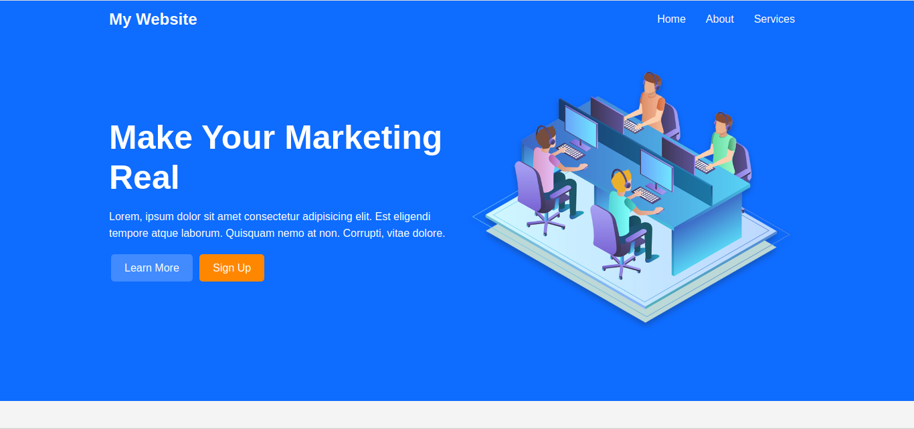

# About Project

My Website Sass is a one page html sass project that I create to learn sass with scss.

In this project I learn how to use variable, import, extends, for, lighten, darken, lightness, if else, and mixins

## How to install

1. Clone this project

```sh
git clone https://github.com/sipamungkas/mywebsite-sass
```

2. Go Project Directory

```sh
cd mywebsite-sass
```

3. Compile with your favorite css compiler
   I use nodejs sass in this case

4. Run Project with vscode live server or open it in your browser with double click on index.html

## Screenshot


